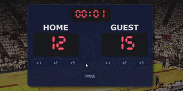
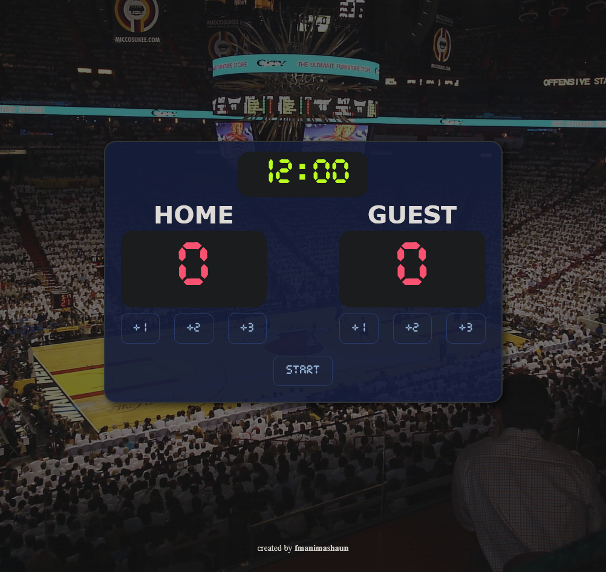

# basketball-scoreboard

  

## 📗 Table of Contents

- [📖 Overview](#about-project)
  - [Project Objectives](#project-objectives)
  - [🛠 Built With](#built-with)
    - [Tech Stack](#tech-stack)
    - [Key Features](#key-features)
  - [🚀 Live Demo](#live-demo)
- [💻 Getting Started](#getting-started)
  - [Setup](#setup)
  - [Prerequisites](#prerequisites)
  - [Install](#install)
- [👥 Authors](#authors)
  - [Developers](#developers)
- [🤝 Contributing](#contributing)
- [⭐️ Show your support](#support)
- [🙏 Acknowledgements](#acknowledgements)
- [📝 License](#license)

## 📖 Overview 

The project was built to showcase my skills in HTML, CSS, and JavaScript and how to build an interactive webpage. This is a simple basketball scoreboard web app to keep track of game scores and timing. The development is based on the given [figma](https://www.figma.com/file/YC48MCx4frBFtYoz6rNJE6/Basketball-Scoreboard) design. This is part of the Scrimba Frontend Developer Career Path solo projects.

### Project Objectives 

- Build a simple basketball scoreboard web app to keep track of game score and timing.
- Use HTML, CSS, and JavaScript to build the project.
- Use the given [figma](https://www.figma.com/file/YC48MCx4frBFtYoz6rNJE6/Basketball-Scoreboard) to build the project.
- create buttons to increase the score based on score type for each team
- create a button to start the game timer
- create a button to pause/resume the game timer
- create a button to reset the game timer and score
- Add confetti effect when the game is over (winner is determined by the team with the highest score).

## 🛠 Built With 

### Tech Stack 

- [HTML](https://developer.mozilla.org/en-US/docs/Web/HTML)
- [JavaScript/ES6](https://262.ecma-international.org/6.0/)
- [Git](https://git-scm.com/)
- [GitHub](https://github.com)
- [figma](https://www.figma.com/)

### Key Features 
- Confetti effect when the game is over (winner is determined by the team with the highest score).
- Buttons to increase the score based on score type for each team
- Button to start the game timer
- Button to pause/resume the game timer
- Button to reset the game timer and score

## 🚀 Live Demo 

> [Live Demo Link](https://fmanimashaun.github.io/basketball-scoreboard/)

  

## 💻 Getting Started 

- [Optional] Install git bash to your machine to enable you to clone this repo.
- install Visual Studio to be able to host a local live version.
- Install a browser to view the local live version.
To get a local copy up and running follow these simple example steps.
### Setup 

- Open your GitHub account the repository's [link](https://github.com/fmanimashaun/basketball-scoreboard)

### Prerequisites 

- Internet connection
- A github account
### Install 

- copy the repo's link and clone it by writing `git clone https://github.com/fmanimashaun/basketball-scoreboard.git` on your git bash terminal (__note: the main branch is the final version__).
- In your visual studio, change the branch to the starter_version branch to view the starter version of the project.
- follow the step-by-step guide on my [blog](https://blog.fmanimashaun.com/basketball-scoreboard) to build the project.

## Authors 

### Developers 

👤 **Engr. Animashaun Fisayo**

- [GitHub](https://github.com/fmanimashaun)
- [Twitter](https://twitter.com/fmanimashaun)
- [LinkedIn](https://www.linkedin.com/in/fmanimashaun/)
- [Website](https://fmanimashaun.com)
- [Blog](https://blog.fmanimashaun.com)

## 🤝 Contributing 

Contributions, issues, and feature requests are welcome!

Feel free to check the [issues page](../../issues/).

## ⭐️ Show your suppor 

Give a ⭐️ if you like this project!

## 📝 License 
This project is [MIT](./LICENSE) licensed.

